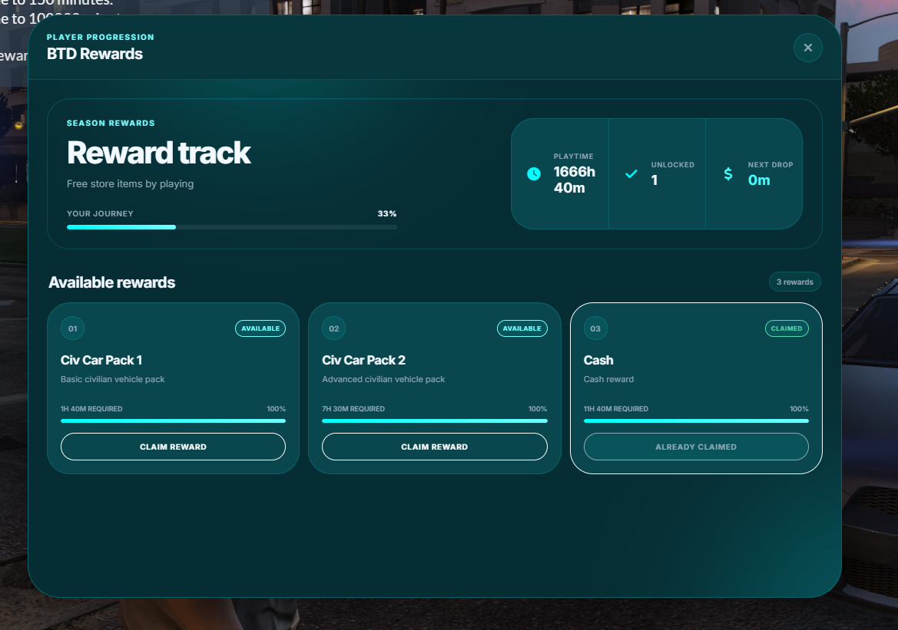

# BTD Rewards

BTD Rewards is a configurable playtime-based reward system for FiveM servers. Players earn active playtime and unlock rewards through a clean, modern NUI interface.

Rewards can include money, custom `ox_inventory` items, reward keys, and custom code-based rewards.

## Features

* Playtime-based reward tiers
* Qbox and standalone support
* `ox_inventory` item rewards
* Customizable reward items and amounts
* Qbox reward keys
* `/redeemreward` command with an `ox_lib` input dialog
* Persistent SQL storage through `oxmysql`
* Reward keys locked to the correct player
* One-time reward redemption
* Configurable reward-key expiration
* `/setplaytime` admin command with an `ox_lib` dialog
* ACE and Qbox group permissions
* `/resetdata` administrative support
* Discord webhook logs for rewards and administrative actions
* Configurable interface colors
* Font Awesome icons
* Responsive NUI design
* Protection against duplicate rewards
* Protection against inventory failures

## Requirements

* [ox_lib](https://github.com/overextended/ox_lib)
* [oxmysql](https://github.com/overextended/oxmysql)
* [ox_inventory](https://github.com/overextended/ox_inventory)
* `qbx_core` when using Qbox mode

## Installation

1. Download or clone the repository into your server's `resources` directory.
2. Import `btd_rewards.sql` into your database.
3. Configure the shared settings inside `config.lua`.
4. Configure protected server settings inside `server_config.lua`.
5. Add the following resources to your `server.cfg`:

```cfg
ensure ox_lib
ensure oxmysql
ensure ox_inventory
ensure btd_rewards
```

When using Qbox, make sure `qbx_core` starts before BTD Rewards:

```cfg
ensure qbx_core
ensure btd_rewards
```

6. Configure the required ACE or Qbox group permissions for administrative commands.
7. Restart the server or start the resource manually.

## Configuration

### Framework Mode

Enable Qbox mode:

```lua
Config.Qbox = true
Config.Standalone = false
```

Enable standalone mode:

```lua
Config.Qbox = false
Config.Standalone = true
```

> Only one framework mode should be enabled at a time.

### Interface Color

```lua
Config.UIColor = 'cyan'
```

### Example Item Reward

```lua
{
    name = 'Cash',
    time = 700,
    description = 'Receive a cash reward.',
    item = 'money',
    amount = 1000
}
```

Set `item` to the registered `ox_inventory` item name. Use `false` when the reward is handled through custom code instead of an inventory item.

## Commands

| Command         | Description                                                     |
| --------------- | --------------------------------------------------------------- |
| `/redeemreward` | Opens an `ox_lib` dialog for redeeming a reward key.            |
| `/setplaytime`  | Allows authorized administrators to change a player's playtime. |
| `/resetdata`    | Resets the configured reward data for a player.                 |

## Security

BTD Rewards includes server-side checks designed to:

* Prevent rewards from being claimed more than once
* Lock reward keys to the intended player
* Reject expired reward keys
* Prevent rewards when inventory insertion fails
* Record reward claims and administrative actions through Discord webhooks

## Preview



## Support

If you discover a bug or have a feature suggestion, please open an issue in the GitHub repository and include:

* A clear description of the issue
* Steps to reproduce it
* Relevant console errors
* Your selected framework mode
* Versions of the required dependencies

## License

Review the repository's license before modifying, redistributing, or selling this resource.


